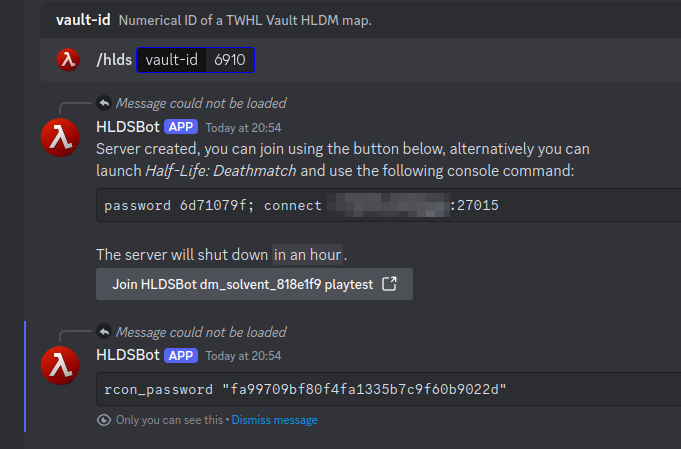

# HLDSBot
Launch ephemeral [Half-Life Dedicated Servers][1] running maps from [TWHL's
Vault][2] via a Discord bot.



[1]: https://developer.valvesoftware.com/wiki/Half-Life_Dedicated_Server
[2]: https://twhl.info/vault/index?games=7&types=1

## Usage
```
# 1. Build the HLDS Docker image.
$ make image

# 2. Build HLDSBot.
$ make

# 3. Configure the environment variables (see below).
# 4. Setup and run a caddy server using the provided example Caddyfile.
# 5. Run HLDSBot as UID 1000.
```
### Environment variables
- `HLDSBOT_BASE_DOWNLOAD_URL`: URL from which TWHL Vault items will be served,
  will be used as a prefix in the `sv_downloadurl` CVar.
- `HLDSBOT_STEAM_REDIRECT_URL`: URL where the `steam://` redirector lives, see
  the `/connect` route on the provided Caddyfile.
- `HLDSBOT_DISCORD_TOKEN`: [Discord bot token][3] for your application.

[3]: https://discord.com/developers/applications

## TODO
- More tests, integrations tests.
- No host networking.
- rcon client and server pruning after five minutes without clients.
- docker-compose the whole thing.

## License
Copyright (C) 2024 Léo Peltier <contact@leo-peltier.fr>

This program is free software: you can redistribute it and/or modify it under
the terms of the GNU General Public License as published by the Free Software
Foundation, version 3.

This program is distributed in the hope that it will be useful, but WITHOUT ANY
WARRANTY; without even the implied warranty of MERCHANTABILITY or FITNESS FOR A
PARTICULAR PURPOSE. See the GNU General Public License for more details.

You should have received a copy of the GNU General Public License along with
this program. If not, see <https://www.gnu.org/licenses/>.
